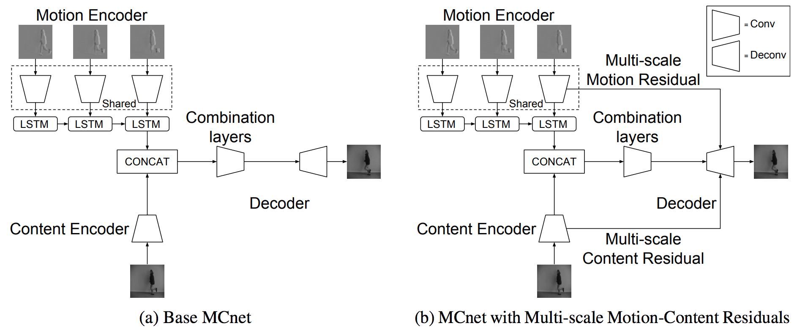

# Main Idea

Exploit the existing spatio-temporal correlations in videos by decomposing the motion and content in the task of unsupervised deterministic frame prediction.

Motion pathway encodes the local dynamics of spatial regions while content pathway encodes the spatial layout of the salient parts of an image.

# Contributions
1. MCnet separates the information streams (motion and content) into different encoder pathways.
2. The proposed network is end-to-end trainable and naturally learns to decompose motion and
content without separate training, and reduces the task of frame prediction to transforming
the last observed frame into the next by the observed motion.
3. Evaluate the proposed model on challenging real-world video datasets, and show that it
outperforms previous approaches on frame prediction

# Takeaways
1. Separating modeling of motion and content improves the quality of the pixel-level future prediction.
2. Using Residual in the network can help generalize well to the unseen contents.
3. Use L_GAN for generating “realistic” frames.
